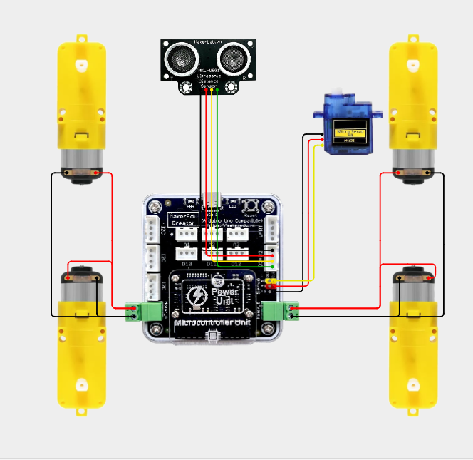
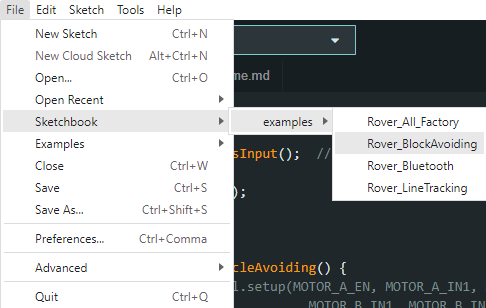

# RoverBot - Tránh vật cản thông minh bằng cảm biến siêu âm

## Giới thiệu

RoverBot sử dụng cảm biến siêu âm để phát hiện và tự động tránh vật cản trên đường đi, kết hợp với RC Servo 9G giúp xoay cảm biến quét trái phải linh hoạt, giúp robot di chuyển mượt mà và an toàn.

## Phần Cứng

| STT | Tên                                                                     | SL |
|:---:|-------------------------------------------------------------------------|:--:|
|  1  | Khung xe RoverBot                                                       |  1 |
|  2  | Mạch MakerEdu Creator with 2 X DC Motor Driver (Arduino Uno Compatible) |  1 |
|  3  | Cáp Kết Nối MakerEdu XH2.54 4Wires 20cm Cable                           |  2 |
|  4  | Dây điện đỏ đen                                                         |  1 |
|  5  | Pin Dự Phòng USB-C 5VDC 2A 5000mAh Mini Power Bank                      |  1 |
|  6  | Cảm Biến Siêu Âm MKE-S01 Ultrasonic Distance Sensor                     |  1 |
| 7   | Động cơ RC Servo 9G                                                     |  1 |

## Sơ đồ kết nối

    

## Nguyên lý hoạt động

- Robot sử dụng cảm biến siêu âm để đo và phát hiện vật cản trong khoảng cách đo được.

- Mặc định xe chạy tiến về phía trước và cảm biến siêu âm sẽ quét vật cản ở phía trước.

- Khi phát hiện vật cản trong khoảng cách được cài đặt trước (mặc định là 20cm) thì xe sẽ dừng lại.

- Tiếp theo, servo quay sang trái đưa cảm biến siêu âm quay theo để kiểm tra xem bên trái robot có vật cản hay không.

- Nếu không có vật cản thì xe sẽ xoay sang phải và tiếp tục đi thẳng.

- Nếu có thì sẽ quay servo sang bên phải và cảm biến siêu âm tiếp tục quét vật cản bên phải để kiểm tra xem có vật cản bên phải xe không.

- Nếu không có thì xe xoay phải và tiếp tục đi thẳng về phía trước.

- Nếu hai bên trái và phải đều có vật cản thì xe sẽ lùi lại và tiếp tục thực hiện quá trình quét vật cản xung quanh.

## Hướng dẫn nạp code

- [Tải repositories tại đây.](https://github.com/makerlabvn/RoverBot/archive/refs/heads/main.zip)
- Sau khi tải về, giải nén file .zip để lấy thư mục **"RoverBot-main"**

### Arduino

- Thay đổi đường dẫn Sketchbook Location thành đường dẫn chỉ tới thư mục **"RoverBot-main"**

    

- Chọn file "Rover_BlockAvoiding.ino" từ File / Sketchbook / examples / Rover_BlockAvoiding

    

- Chọn PORT tương ứng, Board chọn Arduino Uno

    

- Nhấn Upload.

### mBlock

- Mở file ["block_avoiding.mblock"](../../mBlock5/mblockExampleCode/block_avoiding.mblock) tại folder "mBlock5 /mblockExampleCode"

    

- Tại phần Devices, nhấn Connect

    

- Tích vào ô "Show all connectable devices", chọn COM tương ứng rồi nhấn "Connect"

    

- Nhấn "Upload Code"

    

## Điều chỉnh

- Khoảng cách phát hiện vật cản có thể điều chỉnh trong code.
- Tốc độ động cơ và thời gian xoay có thể điều chỉnh để phù hợp với điều kiện thực tế.

---

## Pages

- [RoverBot](/README.md)
- [RoverBot - Bluetooth](/examples/Rover_Bluetooth/readme.md)
- [RoverBot - Line Tracking](/examples/Rover_LineTracking/readme.md)
