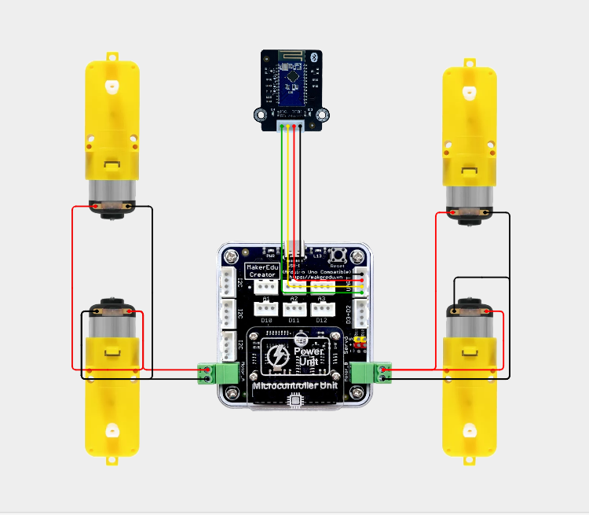
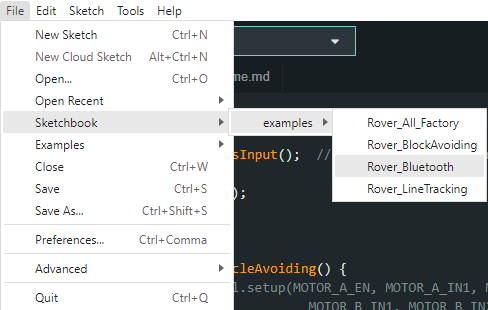

# RoverBot - Điều khiển không dây qua Bluetooth

## Giới thiệu

Điều khiển RoverBot dễ dàng bằng Smartphone hoặc máy tính bảng thông qua kết nối Bluetooth, tạo cảm giác điều khiển robot như chơi một chiếc xe thông minh. Sử dụng module Bluetooth MKE-M15 hỗ trợ kết nối với cả 2 hệ điều hành là Android và IOS.

## Phần Cứng

| STT | Tên                                                                     | SL |
|:---:|-------------------------------------------------------------------------|:--:|
|  1  | Khung xe RoverBot                                                    |  1 |
|  2  | Mạch MakerEdu Creator with 2 X DC Motor Driver (Arduino Uno Compatible) |  1 |
|  3  | Module MKE-M15 Bluetooth 3.0 SPP / BLE 4.2 Dual Mode                    |  1 |
|  4  | Cáp Kết Nối MakerEdu XH2.54 4Wires 20cm Cable                           |  1 |
|  5  | Pin Dự Phòng USB-C 5VDC 2A 5000mAh Mini Power Bank                      |  1 |

## Sơ đồ kết nối

## Hướng dẫn sử dụng

1. Tải và cài đặt ứng dụng Dabble trên điện thoại.

- <a href="https://play.google.com/store/apps/details?id=io.dabbleapp&hl=vi&gl=US">Android</a>

- [IOS](https://apps.apple.com/us/app/dabble-bluetooth-controller/id1472734455)  

  

2. Kết nối Bluetooth với MKE-M15.
(Thêm hình minh hoạ)
4. Mở ứng dụng Dabble, chọn chế độ GamePad.

5. Sử dụng các nút điều hướng để điều khiển xe:
   - Nút Lên: Xe đi thẳng
   - Nút Xuống: Xe đi lùi
   - Nút Trái: Xe quay trái
   - Nút Phải: Xe quay phải
   - Nút **hình X** (X) để test RC Servo quét qua lại.

## Hướng dẫn nạp code

- [Tải repositories tại đây.](https://github.com/makerlabvn/RoverBot/archive/refs/heads/main.zip)
- Sau khi tải về, giải nén file .zip để lấy thư mục **"RoverBot-main"**

### Arduino

- Trong **File/Preferences** Thay đổi đường dẫn **Sketchbook Location** thành đường dẫn chỉ tới thư mục **"RoverBot-main"**

- Chọn file **"Rover_Bluetooth.ino"** từ **File/Sketchbook/examples/**

- Board chọn **Arduino Uno**, Chọn PORT tương ứng với cổng COM của mạch Arduino

- Nhấn **Upload** để nạp code vào mạch Arduino

### mBlock

- Mở file **"bluetooth.mblock"** tại folder **[mBlock5/](https://github.com/makerlabvn/RoverBot/tree/main/mBlock5)**

- Chọn Device là mạch **MakerEdu Creator** và tiến hành kết nối, tích vào ô **"Show all connectable devices"**, chọn COM tương ứng của mạch MakerEdu Creator rồi nhấn **"Connect"**

- Nhấn **"Upload Code"** và chờ đến khi có thông báo hoàn tất

## Tốc độ động cơ

- Tốc độ mặc định: 70 (có thể điều chỉnh mã trong code chương trình).
  
## Pages

- [RoverBot](/README.md)
- [RoverBot - Line Tracking](/examples/Rover_LineTracking/readme.md)
- [RoverBot - Obstacle Avoiding](/examples/Rover_BlockAvoiding/readme.md)
- [RoverBot - All Factory](/examples/Rover_All_Factory/readme.md)
