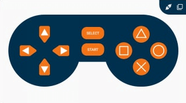

# [MakerEdu Creator] RoverBot - Xe điều khiển từ xa bằng smartphone

## Giới thiệu

- Là một trong ba chức năng của RoverBot, RoverBot_Bluetooth là một dạng xe sử dụng truyền động bánh đai và động cơ Xanh TT V1 Metal Geared 1:90 cho khả năng khởi động và leo dốc tiết kiệm năng lượng và được điều khiển bằng điện thoại thông minh qua ứng dụng Dabble có sẵn trên hai nền tảng là Android và IOS.

- Xe sử dụng module Bluetooth MKE-M15 hỗ trợ kết nối với cả 2 hệ điều hành là Android và IOS  

## Phần Cứng

| STT | Tên                                                                     | SL |
|:---:|-------------------------------------------------------------------------|:--:|
|  1  | Khung xe gỗ RoverBot                                                    |  1 |
|  2  | Mạch MakerEdu Creator With 2 X DC Motor Driver (Arduino Uno Compatible) |  1 |
|  3  | Module MKE-M15 Bluetooth 3.0 SPP / BLE 4.2 Dual Mode                    |  1 |
|  4  | Cáp Kết Nối MakerEdu XH2.54 4Wires 20cm Cable                           |  1 |
|  5  | Dây điện đỏ đen                                                         |  1 |
|  6  | Pin Dự Phòng USB-C 5VDC 2A 5000mAh Mini Power Bank                      |  1 |

## Sơ đồ kết nối

## Hướng Dẫn

- Hướng dẫn lắp ráp  

### Hướng dẫn sử dụng

1. Tải và cài đặt ứng dụng Dabble trên điện thoại

- <a href="https://play.google.com/store/apps/details?id=io.dabbleapp&hl=vi&gl=US">Android</a>

- [IOS](https://apps.apple.com/us/app/dabble-bluetooth-controller/id1472734455)  
  

2. Kết nối Bluetooth với MKE-M15
3. Mở ứng dụng Dabble, chọn chế độ GamePad

4. Sử dụng các nút điều hướng để điều khiển xe:
   - Nút Lên: Xe đi thẳng
   - Nút Xuống: Xe đi lùi
   - Nút Trái: Xe quay trái
   - Nút Phải: Xe quay phải

### Tốc độ động cơ

- Tốc độ mặc định: 70 (có thể điều chỉnh thông qua biến SPEED)

---

## Thông tin liên hệ

- Facebook: [MakerLab RnD](https://www.facebook.com/makerlabvn)
- SĐT & Zalo: 0964.787.150
- Giờ làm việc: Thứ 2 - Thứ 7: 9h00 đến 17h00
