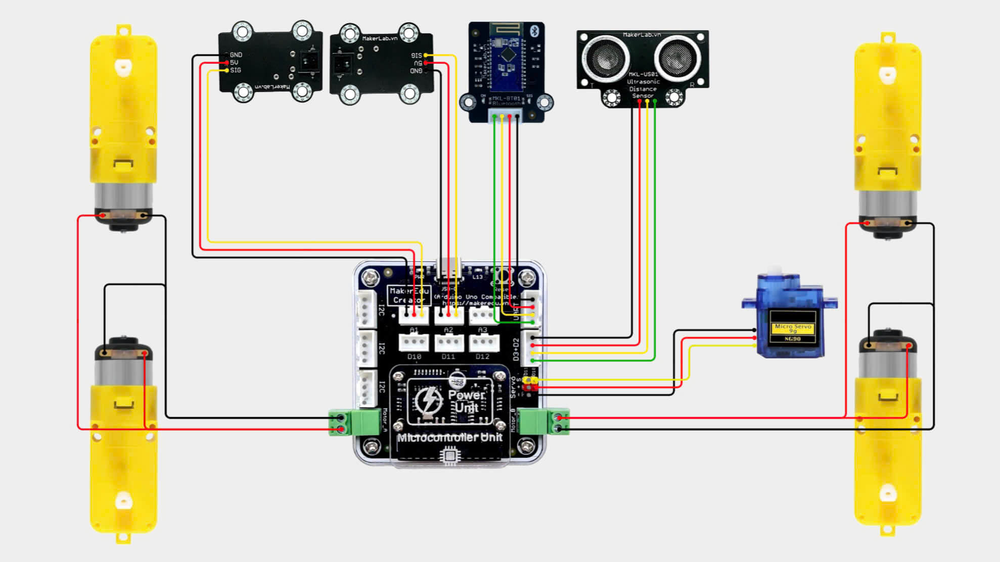
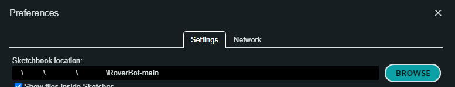
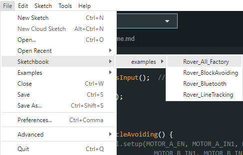
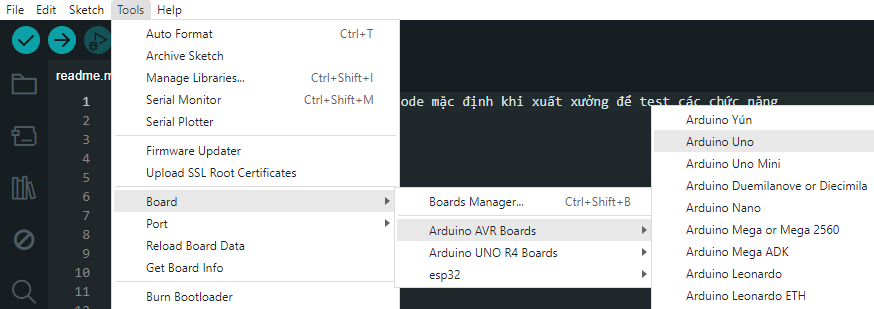
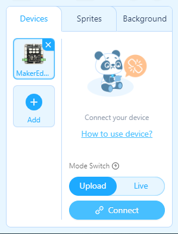
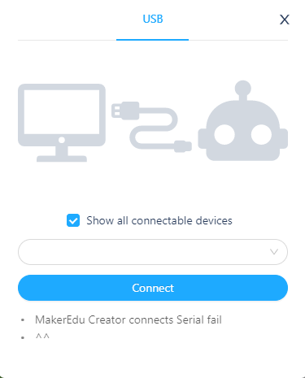
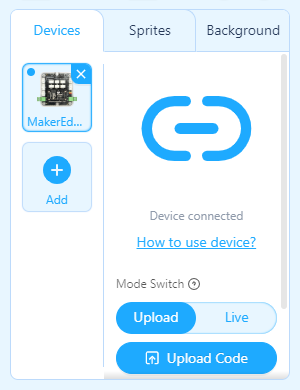

# RoverBot - Default Factory Code - Code mặc định khi xuất xưởng để test các chức năng

## Giới thiệu

Code mặc định khi xuất xưởng là code tổng hợp để test tất cả các chức năng của RoverBot bao gồm: Điều khiển qua Bluetooth bằng SmartPhone, cảm biến siêu âm tránh vật vản, cảm biến dò line.

## Phần Cứng

| STT | Tên                                                                     | SL |
|:---:|-------------------------------------------------------------------------|:--:|
|  1  | Khung xe RoverBot                                                       |  1 |
|  2  | Mạch MakerEdu Creator with 2 X DC Motor Driver (Arduino Uno Compatible) |  1 |
|  3  | Cảm Biến dò line MKE-S10 CNY70 Line Follower Sensor                     |  2 |
|  4  | Cảm Biến Siêu Âm MKE-S01 Ultrasonic Distance Sensor                     |  1 |
|  5  | Module MKE-M15 Bluetooth 3.0 SPP / BLE 4.2 Dual Mode                    |  1 |
|  6  | Cáp Kết Nối MakerEdu XH2.54 4Wires 20cm Cable                           |  2 |
|  7  | Cáp Kết Nối MakerEdu XH2.54 3Wires 20cm Cable                           |  2 |
|  8  | Pin Dự Phòng USB-C 5VDC 2A 5000mAh Mini Power Bank                      |  1 |

## Sơ đồ kết nối

    

## Nguyên lý hoạt động

1. Tải và cài đặt ứng dụng Dabble trên điện thoại.

- <a href="https://play.google.com/store/apps/details?id=io.dabbleapp&hl=vi&gl=US">Android</a>

- [IOS](https://apps.apple.com/us/app/dabble-bluetooth-controller/id1472734455)  

    

2. Kết nối Bluetooth với MKE-M15.
(Thêm hình minh hoạ)
4. Mở ứng dụng Dabble, chọn chế độ GamePad.

    

5. Sử dụng nút **hình vuông** (Square) để chuyển sang chức năng điều khiển. Sử dụng các nút điều hướng để điều khiển xe:
   - Nút Lên : Xe đi thẳng
   - Nút Xuống: Xe đi lùi
   - Nút Trái: Xe quay trái
   - Nút Phải: Xe quay phải
6. Sử dụng nút **hình tròn** (Circle) để chuyển sang chức năng tự hành tránh vật cản bằng cảm biến siêu âm.
7. Sử dụng nút **hình tam giác** (Triangle) để chuyển sang chức năng tự hành bám theo vạch bằng cảm biến dò line.

## Hướng dẫn nạp code

- [Tải repositories tại đây.](https://github.com/makerlabvn/RoverBot/archive/refs/heads/main.zip)
- Sau khi tải về, giải nén file .zip để lấy thư mục **"RoverBot-main"**

### Arduino

- Thay đổi đường dẫn Sketchbook Location thành đường dẫn chỉ tới thư mục **"RoverBot-main"**

    

- Chọn file "Rover_All_Factory.ino" từ File / Sketchbook / examples / Rover_All_Factory

    

- Chọn PORT tương ứng, Board chọn Arduino Uno

    

- Nhấn Upload.

### mBlock

- Mở file ["all_factory.mblock"](../../mBlock5/mblockExampleCode/all_factory.mblock) tại folder "mBlock5 / mblockExampleCode"

    

- Tại phần Devices, nhấn Connect

    

- Tích vào ô "Show all connectable devices", chọn COM tương ứng rồi nhấn "Connect"

    

- Nhấn "Upload Code"

    

## Điều chỉnh

- Có thể điều chỉnh độ nhạy của cảm biến thông qua ngưỡng so sánh trong code.
- Tốc độ động cơ có thể được điều chỉnh để phù hợp với điều kiện thực tế.

---

## Pages

- [RoverBot](/README.md)
- [RoverBot - Bluetooth](/examples/Rover_Bluetooth/readme.md)
- [RoverBot - Obstacle Avoiding](/examples/Rover_BlockAvoiding/readme.md)
- [RoverBot - Line Tracking](/examples/Rover_LineTracking/readme.md)
