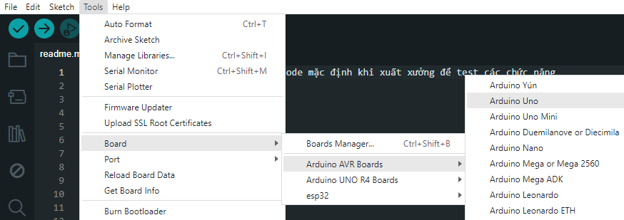

# RoverBot - Dò line chính xác – Theo vạch không lệch hướng

## Giới thiệu

- Hệ thống cảm biến dò line giúp RoverBot dễ dàng bám theo vạch kẻ, phù hợp cho các bài học lập trình điều hướng hoặc các cuộc thi robot dò line tự hành. Cảm biến dò line  MKE-S10 CNY70 Line Follower Sensor cho khả năng nhận biết tốt giữ line đen và line trắng, ngoài ra còn có khả năng chống nhiễu môi trường tốt, giúp xe có thể hoạt động được trong điều kiện ánh sáng ngoài trời mà không bị ảnh hưởng.

- Tín hiệu trả về của cảm biến là analog nên người dùng cần điều chỉnh ngưỡng nhận biết line đen và line trắng phù hợp, tùy vào điều kiện ánh sáng môi trường.

## Phần Cứng

| STT | Tên                                                                     | SL |
|:---:|-------------------------------------------------------------------------|:--:|
|  1  | Khung xe RoverBot                                                       |  1 |
|  2  | Mạch MakerEdu Creator with 2 X DC Motor Driver (Arduino Uno Compatible) |  1 |
|  3  | Cáp Kết Nối MakerEdu XH2.54 4Wires 20cm Cable                           |  1 |
|  4  | Cáp Kết Nối MakerEdu XH2.54 3Wires 20cm Cable                           |  2 |
|  5  | Dây điện đỏ đen                                                         |  1 |
|  6  | Pin Dự Phòng USB-C 5VDC 2A 5000mAh Mini Power Bank                      |  1 |
|  7  | Cảm Biến dò line MKE-S10 CNY70 Line Follower Sensor                     |  2 |  

## Sơ đồ kết nối

    

## Nguyên lý hoạt động

- Robot dựa vào giá trị đọc được từ 2 cảm biến dò line để thực hiện việc điều chỉnh tốc độ động cơ 2 bên sao cho robot luôn hoạt động giữa line.

- Giá trị ngưỡng phát hiện line của cảm biến dò line được đặt mặc định là 450 (có thể điều chỉnh trong code theo điều kiện ánh sáng môi trường).

- Robot sẽ hoạt động theo các trường hợp sau:

    - Đi thẳng: Khi 2 cảm biến đều phát hiện line.

    - Xoay phải: Khi cảm biến bên trái không phát hiện line (robot đang bị lệch sang bên trái).

    - Xoay trái: Khi cảm biến bên phải không phát hiện line (robot đang bị lệch sang bên phải).

    - Tìm line: Khi ra khỏi line sẽ xoay để tìm lại line dựa vào trạng thái đã nhớ trước đó.

## Hướng dẫn nạp code

- [Tải repositories tại đây.](https://github.com/makerlabvn/RoverBot/archive/refs/heads/main.zip)
- Sau khi tải về, giải nén file .zip để lấy thư mục **"RoverBot-main"**

### Arduino

- Thay đổi đường dẫn Sketchbook Location thành đường dẫn chỉ tới thư mục **"RoverBot-main"**

    

- Chọn file "Rover_LineTracking.ino" từ File / Sketchbook / examples / Rover_LineTracking

    

- Chọn PORT tương ứng, Board chọn Arduino Uno

    

- Nhấn Upload.

### mBlock

- Mở file ["line_tracking.mblock"](../../mBlock5/mblockExampleCode/line_tracking.mblock) tại folder "mBlock5 / mblockExampleCode"

    

- Tại phần Devices, nhấn Connect

    

- Tích vào ô "Show all connectable devices", chọn COM tương ứng rồi nhấn "Connect"

    

- Nhấn "Upload Code"

    

## Điều chỉnh

- Có thể điều chỉnh độ nhạy của cảm biến thông qua ngưỡng so sánh trong code (mặc định là 450).
- Tốc độ động cơ có thể được điều chỉnh để phù hợp với điều kiện thực tế.

---

## Pages

- [RoverBot](/README.md)
- [RoverBot - Bluetooth](/examples/Rover_Bluetooth/readme.md)
- [RoverBot - Obstacle Avoiding](/examples/Rover_BlockAvoiding/readme.md)
- [RoverBot - All Factory](/examples/Rover_All_Factory/readme.md)
